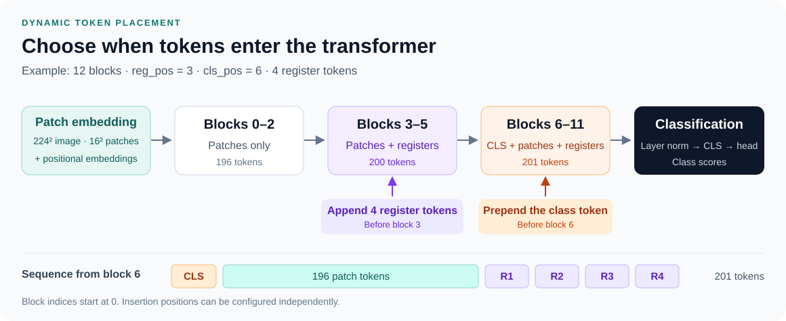
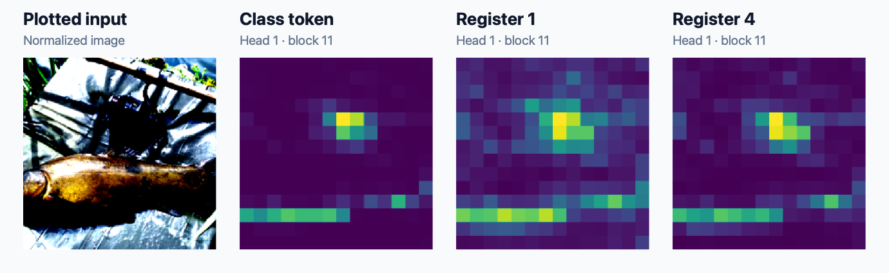
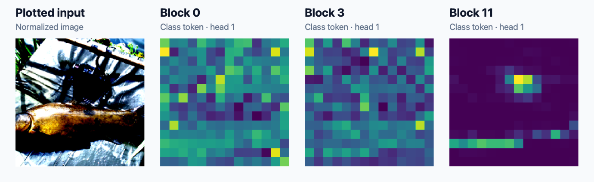

# DynamicTokenLocViT

**Exploring class and register token placement in Vision Transformers.**

Research code developed at Seoul National University (SNU) in 2024. This project builds on DeiT to let you choose the transformer blocks where the class token and register tokens enter the sequence, and inspect their attention to image patches.

[Model idea](#model-idea) · [Attention gallery](#attention-gallery) · [Find your way around](#find-your-way-around) · [Setup](#setup) · [Usage guide](docs/usage.md)

## Model idea

Patch tokens receive positional embeddings before entering the transformer. Register tokens are appended at `reg_pos`, and the class token is prepended at `cls_pos`. The final class representation feeds the classification head.



The diagram shows one configuration: `reg_pos=3`, `cls_pos=6`, and four register tokens. These positions are configurable; either token type can enter first, or both can enter at the same block. **Block indices are zero-based**, so position `0` means before the first block.

| Setting | Command-line flag | Model constructor parameter |
| --- | --- | --- |
| Class token insertion block | `--cls_pos` | `cls_pos` |
| Register token insertion block | `--reg_pos` | `reg_pos` |
| Number of register tokens | `--num_reg` | `num_register_tokens` |

Start with [`vit_register_dynamic_viz`](models/dynamic_vit_viz.py), which implements token insertion and attention extraction.

## Attention gallery

These previews are selected panels from the **existing research PDFs**. No new training or inference was used to create them.

### Class and register attention

The plotted input and head 1 attention from the class token, register token 1, and register token 4 at block 11. Both token types entered at block 0 in this saved example.



[View the complete PDF, including all six heads and four register tokens →](docs/examples/attention_maps_layer_11_of_image_5_cls_0_reg_0.pdf)

### Attention across depth

Class-token attention from head 1 at blocks 0, 3, and 11 for the same saved ImageNet sample (`cls_pos=0`, `reg_pos=0`).



Full PDFs: [block 0](docs/examples/attention_maps_layer_0_of_image_5_cls_0_reg_0.pdf) · [block 3](docs/examples/attention_maps_layer_3_of_image_5_cls_0_reg_0.pdf) · [block 11](docs/examples/attention_maps_layer_11_of_image_5_cls_0_reg_0.pdf)

The original plotting scripts display normalized input tensors, which explains the exaggerated image colors. Heatmaps retain each original panel's color scale and are qualitative examples. See the [figure provenance](docs/figures/README.md) and [full gallery, including CIFAR-10](docs/examples/README.md).

## Find your way around

| What you want to explore | Start here |
| --- | --- |
| Dynamic token placement and attention extraction | [`models/dynamic_vit_viz.py`](models/dynamic_vit_viz.py) |
| Dynamic model without visualization helpers | [`models/dynamic_vit.py`](models/dynamic_vit.py) |
| Main training and evaluation workflow | [`training/main.py`](training/main.py) |
| Training with optional teacher distillation | [`training/distillation.py`](training/distillation.py) |
| Attention maps from a `training/main.py` checkpoint | [`visualization/attention.py`](visualization/attention.py) |
| Simpler CIFAR-10 and ImageNet workflows | [Workflow guide](docs/usage.md#other-research-workflows) |
| Baseline models, shared helpers, and research scratch scripts | [Complete file guide](docs/repository-guide.md) |
| Archived attention figures | [`docs/examples/`](docs/examples/README.md) |

```text
DynamicTokenLocViT/
├── README.md                  Project overview and visual guide
├── docs/
│   ├── usage.md               Commands, data layout, and checkpoint formats
│   ├── repository-guide.md    Map of the source files
│   ├── figures/               README images and their provenance
│   ├── examples/              Original attention-map PDFs
│   └── archive/               Historical experiment command notes
├── models/                    Dynamic ViT models and baseline definitions
├── data_utils/                Dataset builders, augmentation, and samplers
├── training/
│   ├── main.py               Main training and evaluation entry point
│   ├── distillation.py       Optional teacher-distillation workflow
│   ├── cifar/                CIFAR-10 training and evaluation
│   ├── imagenet/             Simpler ImageNet training and evaluation
│   └── trainable_tokens/     Alternative token-model workflow
├── visualization/             Attention-map entry points
├── common/                    Shared utilities and model summaries
├── research/                  Historical research scratch scripts
├── requirements.txt           Pinned research dependencies
└── LICENSE                    MIT license
```

Run entry points as modules from the repository root, for example `python -m training.main` or `python -m visualization.attention`. The [usage guide](docs/usage.md) has complete commands, and the [entry-point migration table](docs/repository-guide.md#entry-point-migration) maps the former script names to their new modules.

Downloaded datasets, checkpoints, and generated run outputs belong in ignored local directories; curated figures live under `docs/`.

## Setup

```bash
git clone https://github.com/adamroberge/DynamicTokenLocViT.git
cd DynamicTokenLocViT
python -m venv .venv
source .venv/bin/activate
python -m pip install -r requirements.txt
```

The dependency pins reflect the original research environment. Model definitions also import `torchsummary`, and the simple training loops use `tqdm`; the [usage guide](docs/usage.md#setup-and-data) covers these additional dependencies and the dataset layouts. Trained checkpoints and datasets are not distributed with this repository.

For commands, start with the [usage guide](docs/usage.md). The original [experiment command notes](docs/archive/commands.sh) are preserved for context and include historical machine-specific paths.

## Acknowledgments and license

Built on [DeiT](https://github.com/facebookresearch/deit), with inspiration from [Vision Transformers Need Registers](https://arxiv.org/abs/2309.16588) and [Going Deeper with Image Transformers](https://arxiv.org/abs/2103.17239).

Project license: [MIT](LICENSE). Upstream copyright and license notices remain in the source files.
